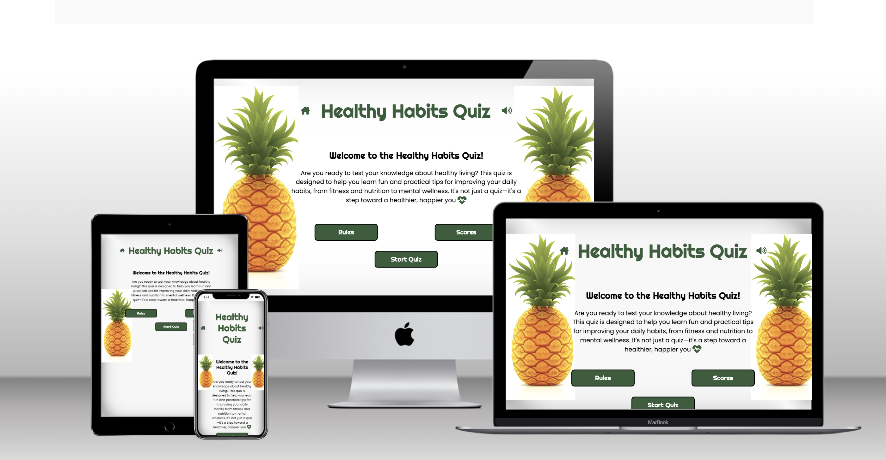

# Healthy Habits Quiz

The **Healthy Habits Quiz** is an interactive, web-based application designed to engage users in a fun and educational experience, helping them assess and reflect on their daily habits while providing actionable tips to promote a healthier lifestyle. This is my second portfolio project for the **Code Institute Full Stack Software Development Diploma**, where I have implemented JavaScript functionality alongside HTML and CSS to create a dynamic and responsive application.

This project builds upon the lessons learned from my first project, focusing on enhancing user interactivity, responsiveness, and overall functionality. With this project, I aim to showcase my growth as a developer while delivering a meaningful and enjoyable experience to users.

---

## Introduction

The **Healthy Habits Quiz** is designed for users of all ages who are interested in evaluating and improving their daily habits. Whether it's about diet, exercise, sleep, or mental wellness, the quiz provides valuable insights into areas where users can enhance their well-being. The application is interactive, visually appealing, and highly accessible, ensuring an engaging user experience across all devices.

This project showcases:
- My ability to use **JavaScript** to create interactivity and dynamic features.
- My understanding of **responsive design principles** to optimize the application for all devices.
- My focus on **user experience (UX)** by designing a clean, intuitive, and accessible interface.

---

## User Experience (UX)

### Strategy
- **Objective**: Provide users with a simple, fun, and informative way to evaluate their daily habits and gain actionable feedback for improvement.
- **User Goals**:
  1. Access an easy-to-use quiz interface that is visually engaging.
  2. Receive meaningful results and recommendations based on quiz responses.
  3. Use the quiz seamlessly on any device, from mobile phones to desktops.
- **Developer Goals**:
  1. Demonstrate proficiency in JavaScript for functionality.
  2. Create a polished, responsive, and accessible design.
  3. Meet project requirements for portfolio submission.

### Scope
The quiz includes:
- A clear homepage with instructions.
- Multiple-choice questions with real-time score tracking.
- Feedback based on user performance.
- Fully responsive design for cross-device compatibility.

### Structure
- A linear structure that guides the user through the quiz, ensuring clarity and ease of navigation.
- Logical feedback provided at the end of the quiz, encouraging users to reflect on their habits.

### Skeleton
Wireframes were designed to outline the basic structure of the quiz:
- **Homepage**: Includes a call-to-action to start the quiz.
- **Quiz Page**: Displays one question at a time with a progress bar.
- **Results Page**: Summarizes the user's performance and provides recommendations.

### Surface
The application uses a clean and modern design, featuring:
- Soft, calming colors to reflect the wellness theme.
- Easy-to-read typography (e.g., **Poppins font** for text).
- Intuitive buttons and tooltips for accessibility.

---

## Features

### Core Features
1. **Homepage**
   - Introduction to the quiz.
   - Start button to begin the quiz.
   - Responsive layout.

2. **Quiz Section**
   - Interactive multiple-choice questions.
   - Progress tracker showing the user's position in the quiz.
   - Dynamic feedback on answers.

3. **Results Section**
   - Summary of user performance.
   - Personalized tips for improvement.
   - Option to retake the quiz.

4. **Navigation**
   - Hamburger menu for mobile devices.
   - Clear navigation for desktop users.

5. **Responsive Design**
   - Optimized for mobile, tablet, and desktop devices.
   - Accommodates various screen sizes and input methods.

---

## Technologies Used

- **HTML5**: Semantic structure and accessibility.
- **CSS3**: Styling and responsiveness.
- **JavaScript**: Dynamic functionality and interactivity.
- **GitHub Pages**: Hosting the live application.
- **Google Chrome DevTools**: Testing and debugging.
- **W3C Validators**: Ensuring code quality and standards compliance.

---

## Testing

### Manual Testing
- **Homepage**: Verified all buttons and links work as expected.
- **Quiz Section**: Confirmed questions and feedback display correctly, and the score is calculated accurately.
- **Responsive Design**: Tested on various devices, including Samsung Galaxy S20, iPhone 12 Mini, and MacBook Air.

### Validation
## Validator Testing

* HTML. No errors were found when testing on the official W3C validator.
* CSS. No errors were found when testing on the official Jigsaw validator.
* Accessibility. I confirm that the chosen colours and fonts are easy to read and accessible by running it through lighthouse in devtools.

---

## Known Issues

- Mobile keyboards can sometimes overlap input fields on smaller devices.
- Some console warnings appear due to browser-specific behavior but do not affect functionality.

---

## Deployment

### Live Deployment
* The site was deployed to GitHub pages. The steps to deploy are:
  - In the GitHub repository choose Settings tab.
  - From the left drop down menu select Pages.
  - When selected Main branch and Save, the page provided the link to the completed webpage.

  The link is here 

### Credits 

* The images for the website was takem from Pexels.
* The sounds for the freesound.org.
* Help to understand and write code ChatGPT 40, Code Institute, Coursera.org, w3schools.com.

